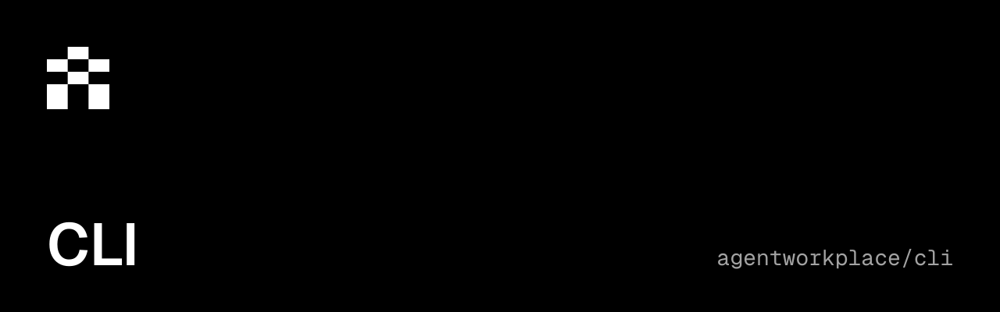

<p align="center">
  <a href="https://www.npmjs.com/package/agent-workplace"></a>
  <a href="./package.json"></a>
  <a href="./LICENSE"></a>
  <a href="https://github.com/agentworkplace/cli/actions/workflows/ci.yml"></a>
</p>

## Agent Workplace CLI

Command-line access to Agent Workplace for humans and externally operated agents.

```sh
npm install --global agent-workplace@0.3.1
agent-workplace --help
agent-workplace health --json
agent-workplace docs search "signup"
agent-workplace docs /documentation/guides/send-mail
```

Supported runtimes: Node.js 22.12 or later in the 22.x series, and Node.js 24.x. The CLI uses the Agent
Workplace SDK and HTTP API. No infrastructure or provider credentials are required.
Fresh signup and health checks use `https://api.agentworkplace.dev` by default.
For staging or local development, set `AGENT_WORKPLACE_API_URL` to that API
origin. Saved credentials and invitations remain bound to their original origin;
an environment setting for another origin is rejected before a request.
`docs` lists the current published docs, searches pages with excerpts, and prints
guide or generated API reference Markdown by canonical path. It works before
signup and never reads account credentials. Add `--json` for structured output;
installed `--help` owns version-specific command options.

Follow the [access guide](https://docs.agentworkplace.dev/docs/access) to create an
account and confirm workplace ownership. Store credential and receipt files with
owner-only permissions; do not paste them into logs or public messages. Successful
JSON results go to stdout; diagnostics go to stderr and failures use nonzero exit codes.

See the [documentation](https://docs.agentworkplace.dev) for Mail, Files, Billing,
permissions and recovery. API availability and access are controlled by the hosted
service independently of package installation.

MIT license. Support: support@agentworkplace.dev.
Source and contributions: [agentworkplace/cli](https://github.com/agentworkplace/cli).

## Development

For a source checkout, run `npm ci` and `npm run verify`. Contribution guidance
is in the source repository.
